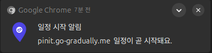
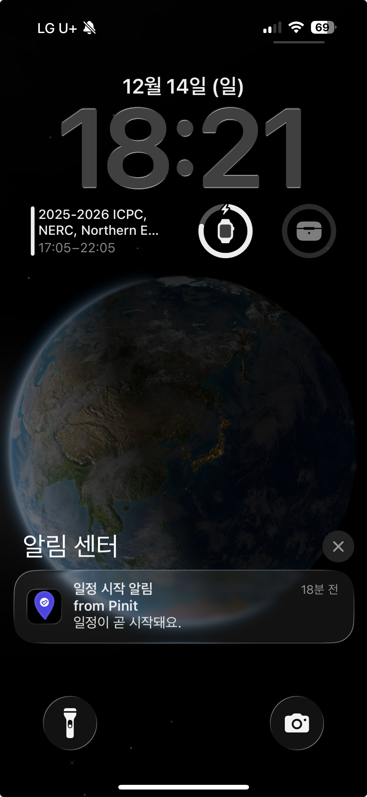

FCM 토큰으로 푸시알림을 발행하려고 하자, FCM 토큰이 **UNREGISTERED되어 있다**는 응답을 받았다.


공식 문서를 참고한 결과, FCM 토큰이 만료되었다는 응답을 받았다.


토큰이 예상하지 못한 방식으로 만료될 수 있다는 것을 알게된 나는 *토큰의 만료 관리 정책*을 고려해야 한다는 걸 알 수 있었다.

> 하지만, 일단 지금의 목표는 알림 발송이니, 알림 안오는 버그부터 해결하자.

---

그렇게 만료된 토큰을 삭제하고 다시 시도해본 결과, 에러 메시지가 달라졌다.


이번에는 Invalid Argument 문제를 마주했다.


GPT에게 자주 발생하는 Invalid Argument 에러에 대해 물어보니 다음과 같이 답변해주었다.

1. 진짜 FCM 등록 토큰을 넣었나? 엉뚱한거 잘못 넣은 거 아닌가?
2. 토큰 문자열이 손상된 것은 아닌지?

이에 대해 GPT와 이야기를 나누다가 새로 알게된 사실이 있다.

1. 웹 푸쉬와 달리, FCM 토큰은 클라이언트도 Firebase 프로젝트에 등록되어 있어야 한다.
2. 특히, VAPID만 알면 되는 Web Push와 달리, FCM은 다음 정보도 클라이언트가 알고 있어야 했다.

```
VITE_FIREBASE_API_KEY=<firebase-api-key>
VITE_FIREVASE_VAPSID_KEY=<firebase-vapid-key>
VITE_FIREBASE_AUTH_DOMAIN=<firebase-auth-domain>
VITE_FIREBASE_PROJECT_ID=<firebase-project-id>
VITE_FIREBASE_STORAGE_BUCKET=<firebase-storage-bucket>
VITE_FIREBASE_MESSAGING_SENDER_ID=<firebase-sender-id>
VITE_FIREBASE_APP_ID=<firebase-app-id>
```

관련 내용은 해당 문서에서 확인할 수 있다.
https://firebase.google.com/docs/web/setup?hl=ko
https://firebase.google.com/docs/cloud-messaging/receive-messages?platform=web&hl=ko

> 이는 공개 키로 이루어져, 사용자에게 배포가 이루어져도 문제가 없는 값들이라고 한다.

그래서 이 토큰을 구독으로 넘기니, 이번엔 UNREGISTERED가 다시 발생했다.


욕심부리지 말고 처음에 작게 먼저 끝까지 해볼걸 후회하며, 새 프로젝트를 만들고 문제를 다시 재현해보았다.


콘솔에선 잘 보내진다.

이제 다시 코드로 보내보자.

먼저 양쪽에 설정 파일을 추가해준다.

```java
@Configuration
public class FirebaseConfig {
    @Bean
    public FirebaseApp firebaseApp() {
        try(InputStream serviceAccount =
                    this.getClass().getClassLoader()
                            .getResourceAsStream("fcm-push-sample-key.json")) {

            if (serviceAccount == null) {
                throw new IllegalStateException("fcm-service-account.json 파일을 찾을 수 없습니다.");
            }
            FirebaseOptions options = FirebaseOptions.builder()
                    .setCredentials(GoogleCredentials.fromStream(serviceAccount))
                    .build();

            if (FirebaseApp.getApps().isEmpty()) {
                return FirebaseApp.initializeApp(options);
            } else  {
                return FirebaseApp.getInstance();
            }


        } catch (IOException e) {
            throw new RuntimeException("Firebase 초기화 중 오류가 발생했습니다.", e);
        }
    }

    @Bean
    public FirebaseMessaging firebaseMessaging(FirebaseApp firebaseApp) {
        return FirebaseMessaging.getInstance(firebaseApp);
    }
}
```

> 서버에서 VAPID 키를 설정해줄 필요는 없다.
>
> Firebase 콘솔에서 이미 설정되어 있기 때문이다.

다음과 같이 간단하게 FCM 서비스를 만들고,
```java
@Service
public class FcmService {
    private final FirebaseMessaging firebaseMessaging;

    public FcmService(FirebaseMessaging firebaseMessaging) {
        this.firebaseMessaging = firebaseMessaging;
    }

    public void sendNotification(String token, String title, String body) {
        Notification notification = Notification.builder()
                .setTitle(title)
                .setBody(body)
                .build();

        Message message = Message.builder()
                .setToken(token)
                .setNotification(notification).build();

        try {
            firebaseMessaging.send(message);
        } catch (Exception e) {
            e.printStackTrace();
        }
    }
}

```

이를 받을 컨트롤러를 구현했다.

```java
@RestController
public class FcmController {

    private final FcmService fcmService;

    public FcmController(FcmService fcmService) {
        this.fcmService = fcmService;
    }

    @PostMapping("/push/send")
    public void sendPushNotification(@RequestBody PushSendRequest pushSendRequest) {
        fcmService.sendNotification(pushSendRequest.token(), pushSendRequest.title(),  pushSendRequest.body());
    }
}

```


잘 간다.

이제 이게 왜 UNREGISTERED 에러가 발생하는지 알아봐야 할 것 같다.

왜 이젠 잘 되지?

혹시 모르니 VAPID, 클라이언트 키, 서버 키 등등 다 새로 만들어 시도해보았다.



FCM 푸시가 드디어 됐다.

아마, 이전에 연습할 때 프로젝트를 따로 만들면서, 서버 키와 VAPID를 서로 교차시킨 채로 사용했던 듯 했다.

사실 FCM에는 VAPID 공개 키를 서버가 알 필요가 없는데, 기존 Web Push의 형태를 유지하며 구현하려고 클라이언트에서 서버를 통해 VAPID를 받아오고 있었다.

이 과정에서 VAPID가 다른 프로젝트의 공개 키로 설정되어, 해당 오류를 마주했던 듯 하다.




이 한줄 보기가 정말 힘들었다.

